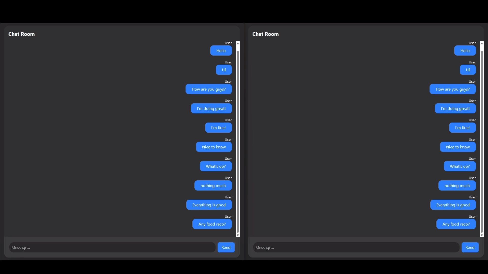

# Chat App

This is a personal project built for a simple chat app system. The app is developed using MongoDB, Express, React and Node.js. It is styled using Tailwind CSS.

Link: https://fullstack-chat-two.vercel.app/

## Interface Preview

| View |
| :---: |
|  |

## Features

- Realtime updates for new chat. The server and client are using socket.io.
